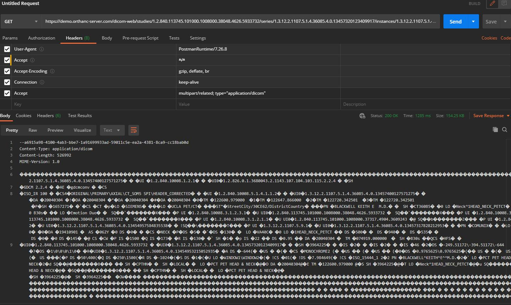
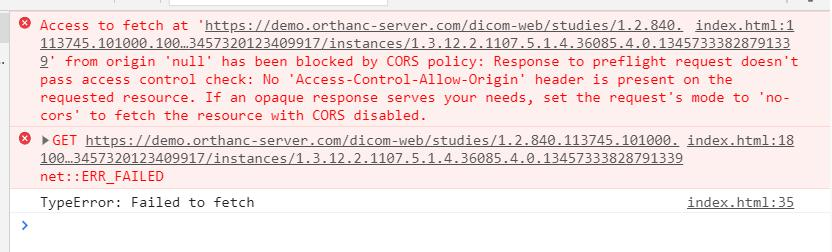
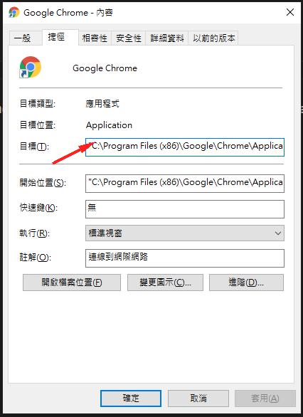

# js-parseMultipartRelated
The DICOMweb RESTFul API of WADO-RS response Multipart/related data that browser cannot download
the DICOM object directly.
This example demos how to download DICOM file from Orthanc with DICOMweb WADO-RS API.

## postman retrieve DICOM object


## DEMO


## Note
### CORS

Disable chrome web security to use this example.

```
Add command after chrome path.

"C:\Program Files (x86)\Google\Chrome\Application\chrome.exe" --disable-web-security --user-data-dir="C:/ChromeDevSession"
```